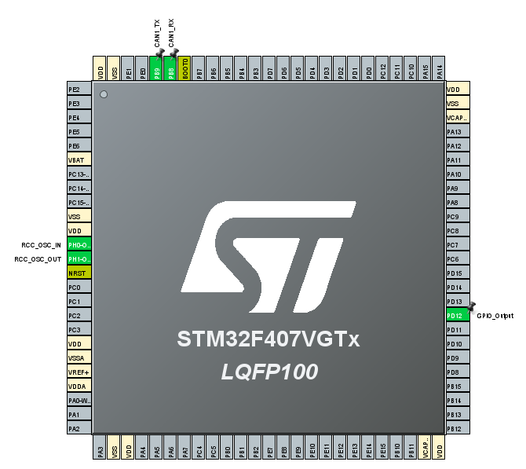
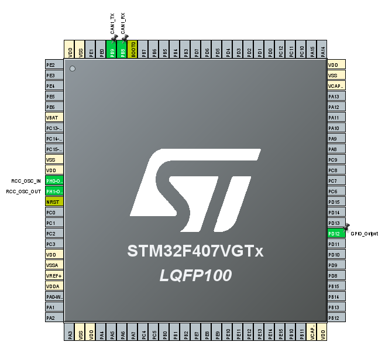
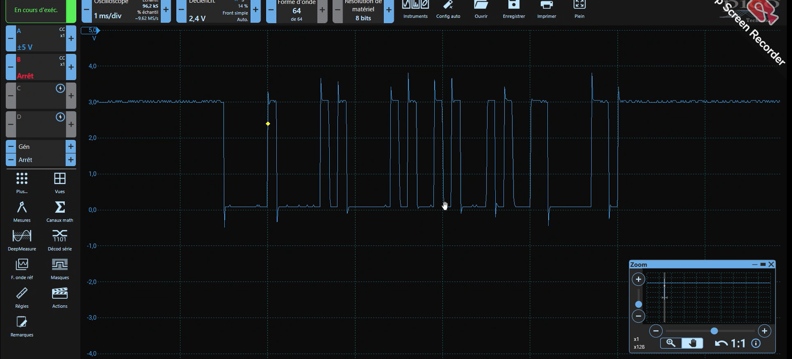

<div align="center">

# CAN Bus Communication — Two STM32F407 Nodes

### Real-time LED synchronization over CAN 2.0, with MCP2551 transceivers


`Embedded Communication` · `Multi-Master Bus` · `Interrupt-Driven RX` · `Physical Layer`

</div>

---

## 📋 Overview

Two STM32F407 boards communicating over a real CAN 2.0 bus, using MCP2551 transceivers to drive the physical differential line. One board transmits a periodic CAN frame and toggles its own LED; the second board listens on the bus, receives the frame through a hardware interrupt (FIFO0), and toggles its LED in response — validating the full CAN cycle: transmit, hardware filtering, and interrupt-driven receive.

## ⚙️ Key Contributions

- 🔗 Configuration and implementation of the CAN protocol on both nodes (transmitter / receiver roles)
- ⚙️ MCP2551 transceivers used for physical bus interfacing
- 📡 Real-time data exchange validated between two independent STM32F407 boards
- 🛠️ System validated under real communication conditions, captured on a PicoScope

## 🔧 Hardware

| Composant | Rôle |
|---|---|
| STM32F407VG ×2 | Nœuds CAN (ARM Cortex-M4) |
| MCP2551 ×2 | Transceiver CAN (ISO 11898, jusqu'à 1 Mb/s) |
| Résistances 120 Ω ×2 | Terminaison de bus (CAN_H / CAN_L) |

### Câblage

| STM32 | → | MCP2551 |
|---|---|---|
| PB9 (CAN1_TX) | → | TXD |
| PB8 (CAN1_RX) | → | RXD |
| 5V | → | VDD |
| GND | → | VSS |

Puis relier les deux transceivers : `CANH ↔ CANH`, `CANL ↔ CANL`, avec la résistance 120 Ω aux deux extrémités du bus.

<div align="center">
  
  <br><em>Broches CAN1_TX (PB9) / CAN1_RX (PB8) — nœud émetteur (STM32F407VGTx)</em>
</div>

<br>

<div align="center">
  
  <br><em>Broches CAN1_TX (PB9) / CAN1_RX (PB8) — nœud récepteur (STM32F407VGTx)</em>
</div>

## ⚡ Configuration CAN

| Paramètre | Valeur |
|---|---|
| Périphérique | CAN1 (PB8 RX / PB9 TX) |
| Mode | Normal |
| Auto-retransmission | Désactivée |
| Prescaler | 1 |
| Sync Jump Width | 1 TQ |
| Time Segment 1 | 6 TQ |
| Time Segment 2 | 1 TQ |
| Format de trame | CAN 2.0A — ID standard 11 bits |
| Réception | Interruption (CAN1_RX0, FIFO0) |

Le filtre matériel est configuré en mode `IDMASK` avec masque `0x00` (aucun filtrage restrictif), routant toutes les trames reçues vers la FIFO0 — le CPU n'est interrompu que sur réception effective, sans scrutation active du bus.

## 🔬 Validation — capture oscilloscope

Trame CAN réelle capturée au PicoScope pendant l'échange entre les deux nœuds.

<div align="center">
  
  <br><em>Signal numérique du bus CAN capturé en conditions réelles de communication</em>
</div>

## 💻 Code — Nœud émetteur (Transmitter)

Configuration et envoi périodique d'une trame CAN, avec toggle LED synchronisé :

```c
// Configuration de l'en-tête de la trame CAN
TxHeader.DLC = 1;              // 1 octet de données
TxHeader.IDE = CAN_ID_STD;     // ID standard (11 bits)
TxHeader.RTR = CAN_RTR_DATA;   // Trame de données
TxHeader.StdId = 0x01;         // Identifiant du nœud émetteur

HAL_CAN_Start(&hcan1);
TxData[0] = 40;

// Boucle principale : émission périodique
while (1)
{
    HAL_CAN_AddTxMessage(&hcan1, &TxHeader, TxData, &TxMailbox);
    HAL_GPIO_TogglePin(GPIOD, GPIO_PIN_12);  // LED locale
    HAL_Delay(500);
}
```

## 💻 Code — Nœud récepteur (Receiver)

Configuration du filtre matériel et réception interruptive via FIFO0 :

```c
// Configuration du filtre CAN (FIFO0, sans restriction d'ID)
canfilterconfig.FilterActivation      = CAN_FILTER_ENABLE;
canfilterconfig.FilterBank            = 10;
canfilterconfig.FilterFIFOAssignment  = CAN_FILTER_FIFO0;
canfilterconfig.FilterIdHigh          = 0x00;
canfilterconfig.FilterIdLow           = 0x00;
canfilterconfig.FilterMaskIdHigh      = 0x00;
canfilterconfig.FilterMaskIdLow       = 0x00;
canfilterconfig.FilterMode            = CAN_FILTERMODE_IDMASK;
canfilterconfig.FilterScale           = CAN_FILTERSCALE_32BIT;

HAL_CAN_ConfigFilter(&hcan1, &canfilterconfig);
HAL_CAN_ActivateNotification(&hcan1, CAN_IT_RX_FIFO0_MSG_PENDING);

// Callback déclenché automatiquement à la réception d'une trame
void HAL_CAN_RxFifo0MsgPendingCallback(CAN_HandleTypeDef *hcan1)
{
    HAL_CAN_GetRxMessage(hcan1, CAN_RX_FIFO0, &RxHeader, RxData);
    HAL_GPIO_TogglePin(GPIOD, GPIO_PIN_12);  // LED miroir
}
```

## 🚀 Build & Flash

1. Ouvrir chaque projet (`transmitter` / `receiver`) dans STM32CubeIDE
2. Compiler en configuration Debug
3. Flasher chaque carte via ST-LINK — une carte avec le firmware émetteur, l'autre avec le firmware récepteur
4. Relier les deux transceivers MCP2551 avec la terminaison 120 Ω aux deux extrémités
5. Observer les deux LEDs se synchroniser en temps réel

## 🛠 Tech Stack

`STM32F407` · `CAN 2.0A` · `MCP2551` · `STM32 HAL` · `Interrupt-driven RX` · `Hardware ID filtering` · `STM32CubeIDE`

## 📄 License

MIT
